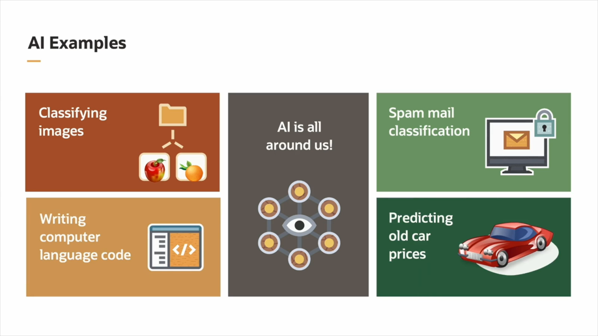
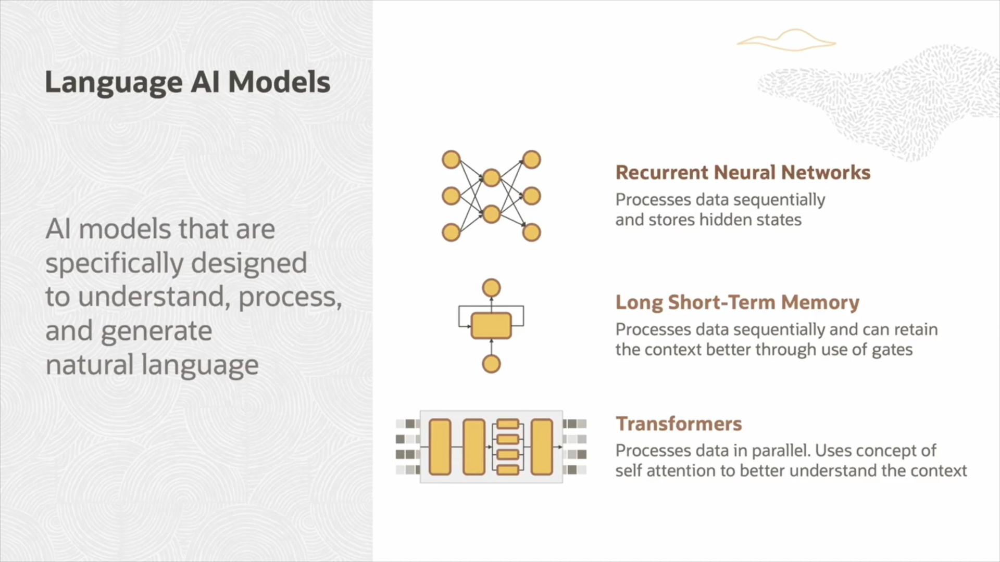
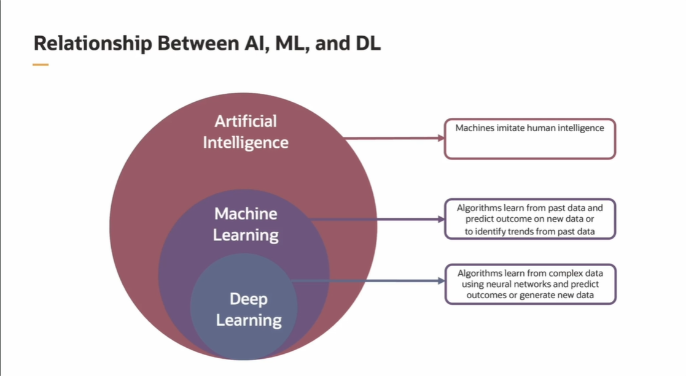

# What is Artificial intelligence?
Artificial Intelligence (AI) is a branch of computer science that enables machines and software to perform tasks that normally require human intelligence, such as learning, understanding, decision-making, and recognizing images or speech.  
In simple terms: it’s the ability of computers to "think" or "act" intelligently like humans.

## AI example:
* **Voice Assistants:** Siri, Alexa, Google Assistant—understand and respond to your voice.
* **Image Recognition:** Facebook tags people in photos automatically; self-driving cars detect traffic signs.
* **Recommendation Systems:** Netflix, YouTube, and Amazon suggest movies, videos, and products based on your preferences.
* **Machine Translation:** Google Translate translates text and speech between languages.
* **Chatbots:** Online customer service bots answer questions anytime.
* **Medical Diagnosis:** AI helps doctors analyze scans and detect diseases.
* **Data Analysis & Prediction:** Banks detect fraud; airlines optimize flight schedules.

## Language AI Models:
*  Recurrent Neural Networks(RNN)
*  Long short _Term Memory(LStM):LSTM helps retain important information for long periods while ignoring irrelevant information, making it more effective in handling long sequential data.
* Transform:LLMs and RAG models fall under the Transformer architecture, which processes the entire sequence simultaneously (not step-by-step), making it faster. They use the Attention mechanism to focus on important parts of the sequence regardless of distance, resulting in better performance, especially on long sequences.

Fact:
RAG combines retrieving information from external sources with text generation using a language model, allowing it to connect words and meanings based on real and up-to-date information—similar to how humans consult references before answering.
In contrast, LLMs rely solely on the knowledge learned during training, which may make them less accurate in linking words to their meanings in new contexts or with recent information.

## Difference between AI,DL,ML
* AI (Artificial Intelligence): A broad field focused on creating systems that can perform tasks requiring human intelligence like reasoning, learning, and decision-making.

* ML (Machine Learning): A subset of AI where systems learn from data and improve their performance without being explicitly programmed for every task.

* DL (Deep Learning): A subset of ML that uses multi-layered neural networks to solve complex problems like image and speech recognition.

## Types of Machine Learning:

1.Supervised Learning:EXTRACT RULES DATA

2.Unsupervised Learning:EXTRACT TRENDS FROM DATA

3.Reinforcement Learning:The model learns to make decisions by interacting with an environment, receiving rewards or penalties based on its actions.

