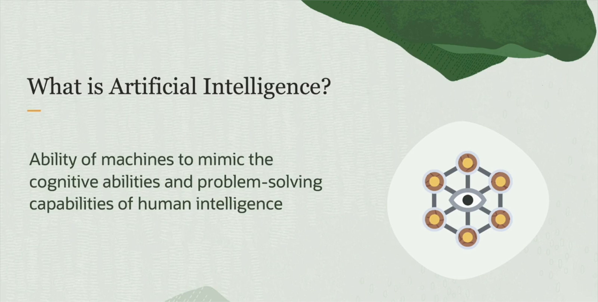

# what is Artificial intelligence?
Artificial Intelligence (AI) is a branch of computer science that enables machines and software to perform tasks that normally require human intelligence, such as learning, understanding, decision-making, and recognizing images or speech.  
In simple terms: it’s the ability of computers to "think" or "act" intelligently like humans.

