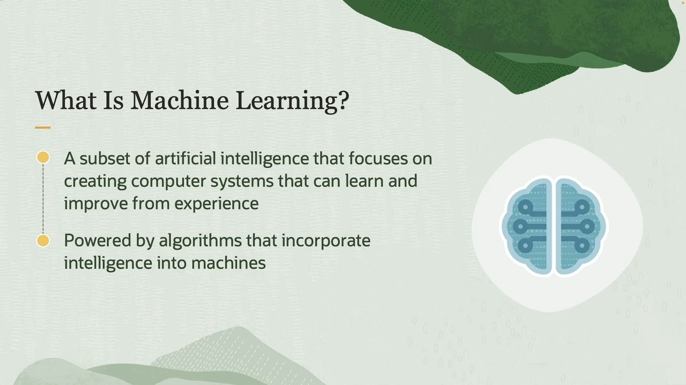
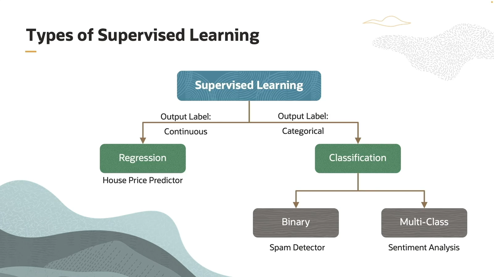

# What is machine learning?

ChatGPT said:
Machine Learning is a branch of Artificial Intelligence (AI) that focuses on developing systems that can learn from data and improve their performance over time without being explicitly programmed for each specific task.

The core idea: instead of writing fixed instructions, we provide the model with data and examples, and it learns the patterns and relationships to make decisions or predictions.

Examples:

* Predicting stock prices.

* Classifying images (e.g., distinguishing between a cat and a dog).

* Recommendation systems (e.g., suggesting movies on Netflix).

FACT

TF-IDF:

The tool analyzes the texts automatically.

It identifies the important words based on their frequency and significance across all documents.

It converts the texts into numerical features ready for training without manually selecting or weighting the words.

## Waht is Supervide learning?

 is a type of machine learning where the model is trained on labeled data (features + labels) so it learns the relationship between inputs and outputs, and can then predict outputs for new inputs.

## Types of supervide Learning:

* Regression:(continues)

is a type of Supervised Learning used when the output is a continuous numerical value rather than a category.
Instead of predicting a class (“cat” or “dog”), it predicts a number or a trend line.

📌 Examples:

* Predicting the price of a house based on its size and location.

* Plotting a curve to show sales growth over time.

* Analyzing the relationship between time and the number of users (which can produce a growth trend graph).

* classification(categorical)
  1-Binary:is a type of Supervised Learning where the output has only two possible outcomes, such as True/False, Yes/No, or 0/1.

  2-Multi-Class:is a type of Supervised Learning where the output can be one of three or more categories, such as classifying an image as cat, dog, or bird.

