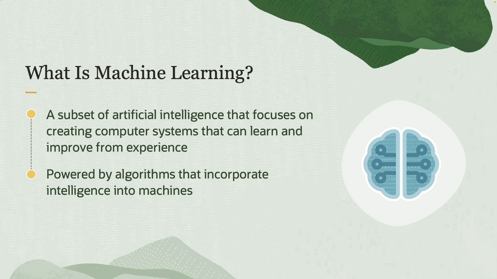

# What is machine learning?

ChatGPT said:
Machine Learning is a branch of Artificial Intelligence (AI) that focuses on developing systems that can learn from data and improve their performance over time without being explicitly programmed for each specific task.

The core idea: instead of writing fixed instructions, we provide the model with data and examples, and it learns the patterns and relationships to make decisions or predictions.

Examples:

* Predicting stock prices.

* Classifying images (e.g., distinguishing between a cat and a dog).

* Recommendation systems (e.g., suggesting movies on Netflix).

