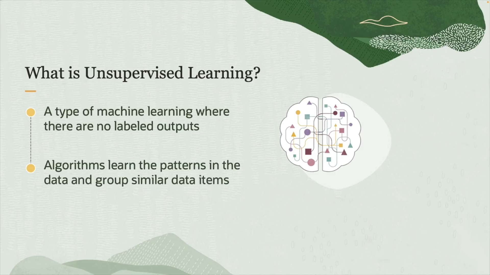
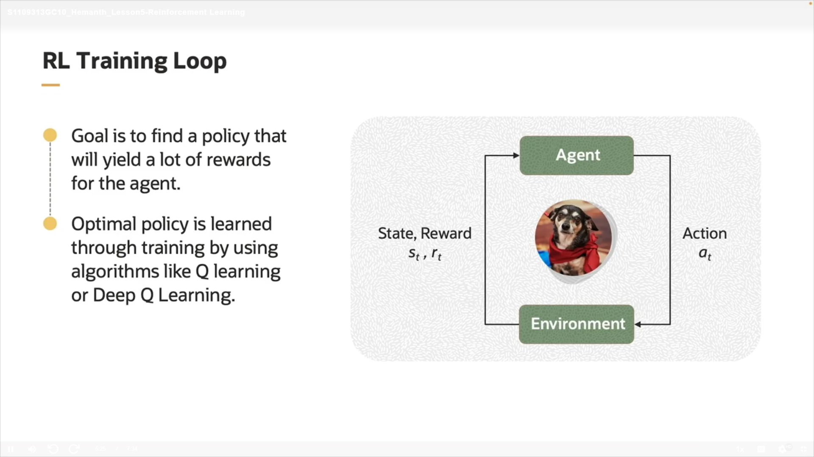

# What is machine learning?

ChatGPT said:
Machine Learning is a branch of Artificial Intelligence (AI) that focuses on developing systems that can learn from data and improve their performance over time without being explicitly programmed for each specific task.

The core idea: instead of writing fixed instructions, we provide the model with data and examples, and it learns the patterns and relationships to make decisions or predictions.

üìå Examples:

* Predicting stock prices.

* Classifying images (e.g., distinguishing between a cat and a dog).

* Recommendation systems (e.g., suggesting movies on Netflix).

FACT

TF-IDF:

The tool analyzes the texts automatically.

It identifies the important words based on their frequency and significance across all documents.

It converts the texts into numerical features ready for training without manually selecting or weighting the words.

## What is Supervide learning?

 is a type of machine learning where the model is trained on labeled data (features + labels) so it learns the relationship between inputs and outputs, and can then predict outputs for new inputs.

## Types of supervide Learning:

* REGRATION:(continues)

   is a type of Supervised Learning used when the output is a continuous numerical value rather than a category.
   Instead of predicting a class (“cat” or “dog”), it predicts a number or a trend line.

   üìå Examples:

    * Predicting the price of a house based on its size and location.

    * Plotting a curve to show sales growth over time.

    * Analyzing the relationship between time and the number of users (which can produce a growth trend graph).

* CLASSIFICATION(categorical)

  1-Binary:is a type of Supervised Learning where the output has only two possible outcomes, such as True/False, Yes/No, or 0/1.

  2-Multi-Class:is a type of Supervised Learning where the output can be one of three or more categories, such as classifying an image as cat, dog, or bird.

  FACT:

   * Logistic regression → Outputs a probability value (0 ≤ p ≤ 1).

   * Linear regression ‚Üí Outputs a continuous numerical value (can be any real number)

# What is Unsupervide Learning?

  is a type of machine learning where the model learns from data that does not contain labels or correct answers.

  Instead of learning to map inputs to outputs, it tries to discover patterns, groups, or hidden structures within the data on its own.

  üìå Examples of tasks in Unsupervised Learning:

  * Clustering:Grouping data into clusters based on similarity (e.g., grouping customers by their behavior).

  * Dimensionality Reduction:Reducing the number of features while preserving important information (e.g., reducing image dimensions while keeping its content).

# What is Reinforcement Learning?

 is a type of machine learning where an agent learns to make decisions by interacting with an environment to maximize rewards or avoid penalties.

# How it works ?
 * The agent takes an action in the environment.

 * The environment gives feedback in the form of rewards or penalties.

 * The agent learns from this experience to choose actions that maximize cumulative rewards over time.

Simple example:

Teaching a robot to walk or playing a game like chess, where the robot or player improves its moves based on the rewards or penalties it receives.

