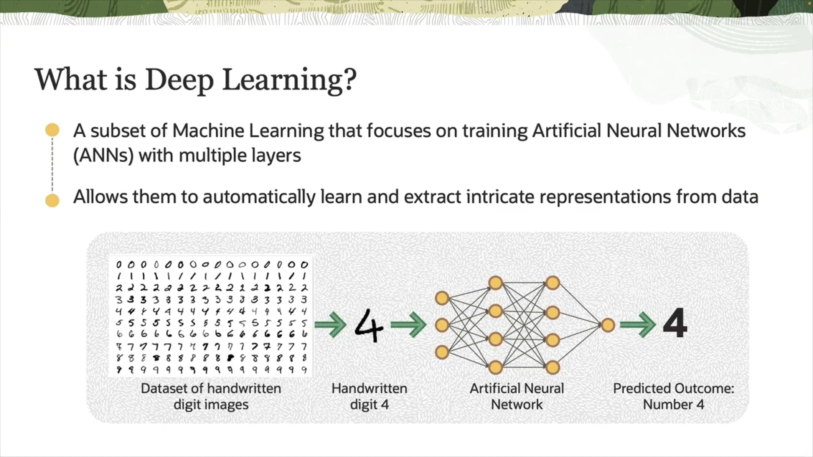
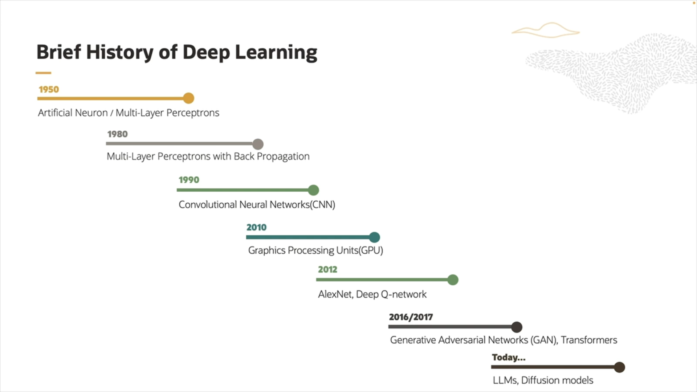

# What is Deep Learning?
is a branch of Machine Learning that focuses on using multi-layered artificial neural networks (Deep Neural Networks) to mimic how the human brain processes information and recognizes complex patterns.

# Features of Deep Learning:

 * It can learn complex representations directly from raw data (such as images, audio, text) without much human intervention in feature extraction.

 * Uses many layers (deep) of interconnected neurons that process information sequentially.

 * Applied in tasks like image recognition, machine translation, speech analysis, and autonomous driving.

## History Deep Learning

