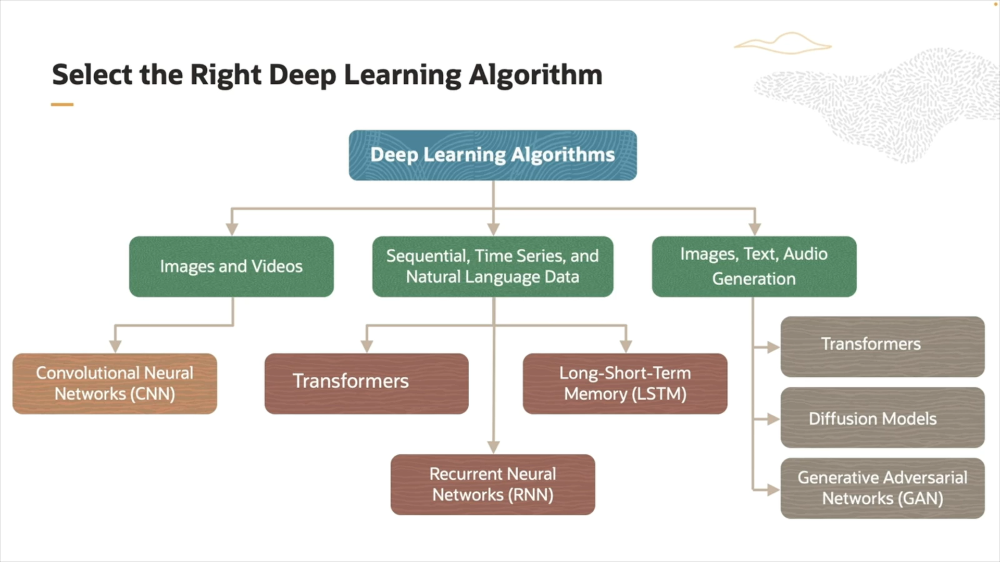
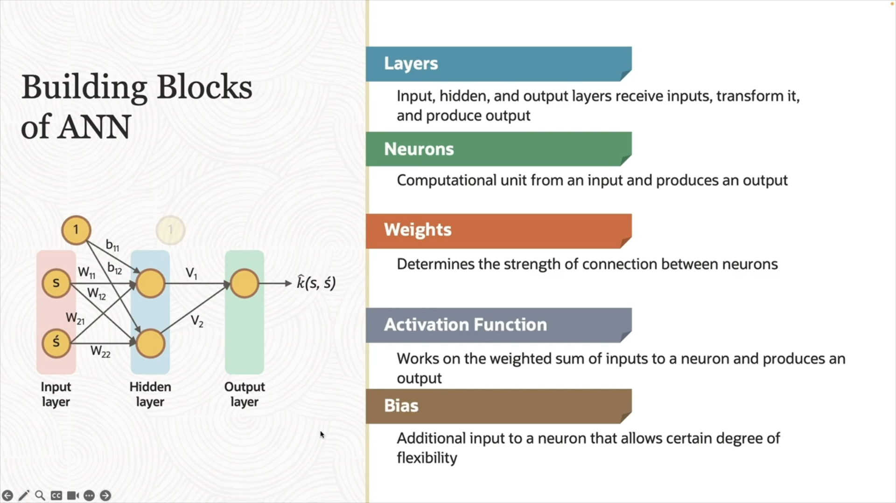
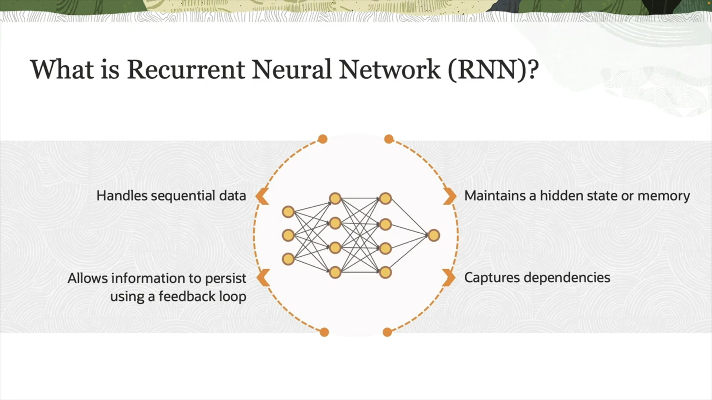

# What is Deep Learning?
is a branch of Machine Learning that focuses on using multi-layered artificial neural networks (Deep Neural Networks) to mimic how the human brain processes information and recognizes complex patterns.

# Features of Deep Learning:

 * It can learn complex representations directly from raw data (such as images, audio, text) without much human intervention in feature extraction.

 * Uses many layers (deep) of interconnected neurons that process information sequentially.

 * Applied in tasks like image recognition, machine translation, speech analysis, and autonomous driving.

## History Deep Learning

## Deep Learning Algorithm:

1-Images and Videos:

 * Usually, Convolutional Neural Networks (CNNs) are used because they are excellent at detecting patterns in images and videos.

 * Videos are considered sequences of images, so CNNs can be combined with temporal models to handle the time dimension.

2-Speech and Text:

 * For these, models that handle **sequential data** like Recurrent Neural Networks **(RNNs)**, especially LSTM, are used because they can manage long-term temporal relationships.

 * Also, Transformers have become very popular recently for analyzing text and speech.

## What is an ANN?

Imagine a large network of tiny cells (like brain cells).
Each tiny cell is called a "neuron."
These neurons are connected to each other in layers.

## What does Deep Learnig do?

First, it takes information or data (for example, an image or text).

Then, this data moves from one layer to another.

Each layer processes the data using numbers called weights and **BIAS** to understand parts of the data.

In the end, it produces a result (for example, it says whether the image contains a cat or a dog)

## What RNN (Recurrent Neural Network)?

It is a type of neural network specifically designed to handle sequential or time-ordered data, such as text, speech, or time series.

One key feature of RNN is the feedback loop:
This loop allows the network to retain information from previous steps and use it when processing the current input, enabling the model to understand context and dependencies over time.

