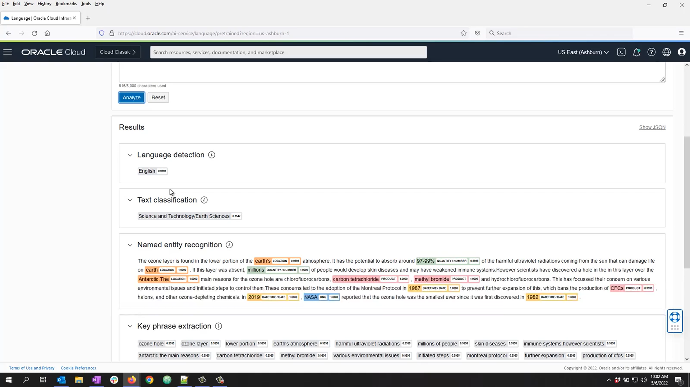
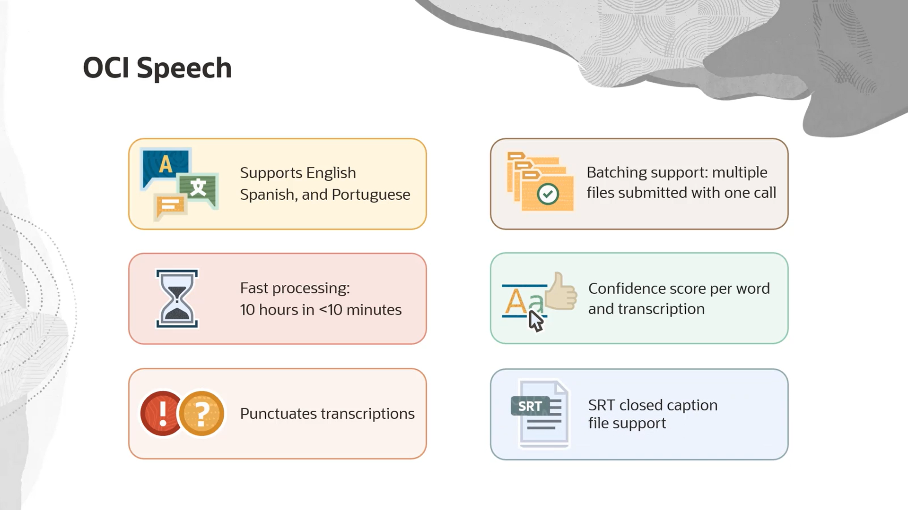

# Text analysis

# What OCI Speech?
 is a service from Oracle Cloud Infrastructure (OCI) that uses AI to automatically convert spoken audio into written text.
In simple terms:

   * You upload an audio file or record speech directly.

   * The service performs Speech-to-Text conversion.

   * It supports multiple languages and dialects (depending on configuration).

   * It can be used for things like meeting transcriptions, call logs, searchable audio archives, or even voice commands in applications.
Key features in OCI:

  * High accuracy using advanced AI models.

  * Supports real-time processing or processing of pre-recorded files.

  * Easy integration with other OCI services like OCI Digital Assistant or OCI Language.

