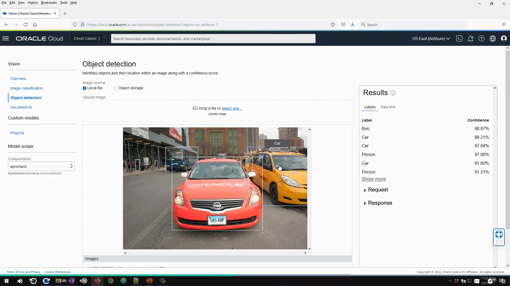

# Text analysis

# What OCI Speech?
 is a service from Oracle Cloud Infrastructure (OCI) that uses AI to automatically convert spoken audio into written text.
In simple terms:

   * You upload an audio file or record speech directly.

   * The service performs Speech-to-Text conversion.

   * It supports multiple languages and dialects (depending on configuration).

   * It can be used for things like meeting transcriptions, call logs, searchable audio archives, or even voice commands in applications.
Key features in OCI:

  * High accuracy using advanced AI models.

  * Supports real-time processing or processing of pre-recorded files.

  * Easy integration with other OCI services like OCI Digital Assistant or OCI Language.

# What is demo vision?
  * A small showcase or test version of a vision-based AI solution.

  * Used to show capabilities like object detection, facial recognition, image classification, OCR (reading text from images), or scene understanding.

  * Could be interactive — for example, uploading an image and seeing how the AI labels it.

  * In the context of Oracle Cloud (OCI) or similar platforms, a "Demo Vision" might be:

  * A sample application that demonstrates OCI Vision service, which can classify images, detect objects, and extract text from images.

  * A quick start tool for developers to try the service without building a full production app
  

  # What is Document AI ?

 Document AI (Document Artificial Intelligence) is a branch of AI focused on helping computers understand, process, and extract information from documents — whether they’re PDFs, scanned images, forms, invoices, contracts, or handwritten notes.

It combines several AI technologies, including:

  * OCR (Optical Character Recognition): Converts printed or handwritten text in images/PDFs into machine-readable text.

  * Natural Language Processing (NLP): Understands the meaning, context, and structure of the extracted text.

  * Computer Vision: Helps detect layouts, tables, checkboxes, and other visual elements.

  * Machine Learning Models: Classify documents, extract specific fields (e.g., names, dates, amounts), and handle variations in document formats.

What  Document AI used for?

  * Automatically processing invoices and receipts.

  * Extracting key data from contracts.

  * Digitizing and indexing scanned archives.

  * Speeding up workflows in banking, insurance, healthcare, and government services.

 

