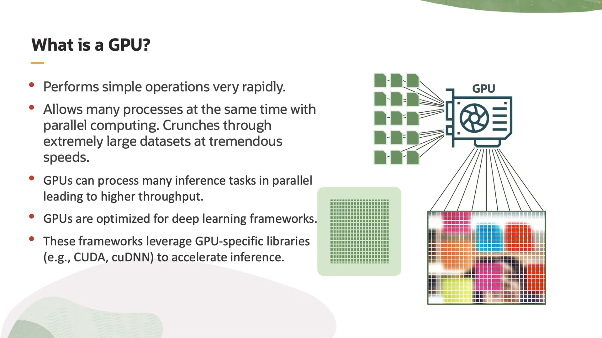
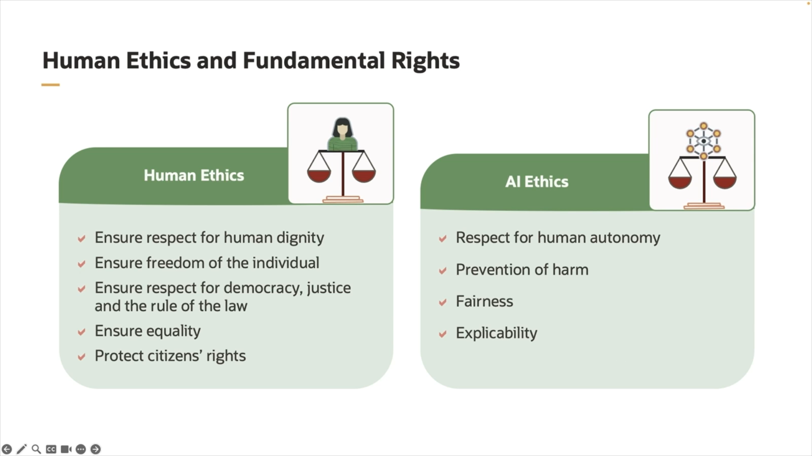

# Language Overview (Language Models)

Language models are AI systems designed to understand, generate, and work with human language. They analyze patterns in text to predict the next word, complete sentences, translate languages, or even generate creative content.

Key Points:

  * They are trained on vast amounts of text data.

  * Use statistical and deep learning techniques to grasp grammar, context, and meaning.

  *  Examples include GPT, BERT, and Transformer models.

  * Applications: chatbots, translation, sentiment analysis, summarization, and more.

  # Vision Overview(vision Models)

   Computer Vision is a field of artificial intelligence focused on enabling machines to interpret and understand visual information from the world, such as images and videos.

 Key Points:

   * It involves tasks like image recognition, object detection, image segmentation, and video analysis.

   * Uses techniques such as Convolutional Neural Networks (CNNs) to automatically extract features and patterns from visual data.

   * Applied in areas like self-driving cars, facial recognition, medical imaging, and surveillance.

## Speech Overview:

Speech processing is a branch of artificial intelligence focused on enabling machines to understand, interpret, and generate human speech.

 Key Points:

  * Includes tasks like speech recognition (converting spoken words to text), speech synthesis (text-to-speech), and speaker identification.

  * Uses models like RNNs, LSTMs, and more recently Transformers to process and analyze audio data.

  * Applied in virtual assistants (like Siri and Alexa), transcription services, language translation, and voice-controlled devices.

## Document Understanding:

Document Understanding is a field in AI that focuses on enabling machines to read, interpret, and extract meaningful information from documents such as PDFs, scanned images, forms, and text files.

Key Points:

  * Combines technologies like Natural Language Processing (NLP), Optical Character Recognition (OCR), and Computer Vision.

  * Tasks include text extraction, entity recognition, classification, and summarization of documents.

  * Used in automating workflows like invoice processing, contract analysis, and legal document review.

## Digital Assistant:

A Digital Assistant is an AI-powered software designed to help users perform tasks, answer questions, and provide information through natural language interactions, often via voice or text.

Key Points:

  * Uses technologies like Natural Language Processing (NLP), Speech Recognition, and Machine Learning.

  * Examples include Siri, Alexa, Google Assistant, and Cortana.

  * Can perform tasks like setting reminders, answering queries, controlling smart devices, and managing schedules.

## What is a GPU?

A GPU is a specialized processor originally designed to accelerate graphics rendering, such as images and videos, by performing many calculations simultaneously.

## Why is GPU important?

  * It has thousands of smaller cores that can handle multiple tasks in parallel, making it much faster than a regular CPU for certain operations.

  * Widely used in gaming, video editing, and scientific simulations.

  * Crucial in AI and machine learning for speeding up training and inference of complex models like deep neural networks.

## what is OCI RDMA SuperCluster?
It’s an infrastructure within Oracle’s cloud (OCI) that uses RDMA technology combined with the SuperCluster system to provide:

  * Ultra-fast data transfer between servers.

  * Extremely high performance for demanding applications like large databases, analytics, and AI workloads.

  * The ability to handle very heavy workloads efficiently and with low latency.

## What does include Ethical Ai?

   * Fairness: Avoiding bias or discrimination against any group or individual.

   * Transparency: Making AI systems understandable and clear so users know how decisions are made.
  
   * Privacy: Protecting user data and not using it unlawfully or harmfully.

   * Accountability: Having responsible people for the AI’s actions, so if something goes wrong, someone takes responsibility.

   * Safety: Ensuring the AI system is secure and not exploitable for harmful purposes.

   * Respect for Human Rights: Making sure AI doesn’t violate or harm human rights.

