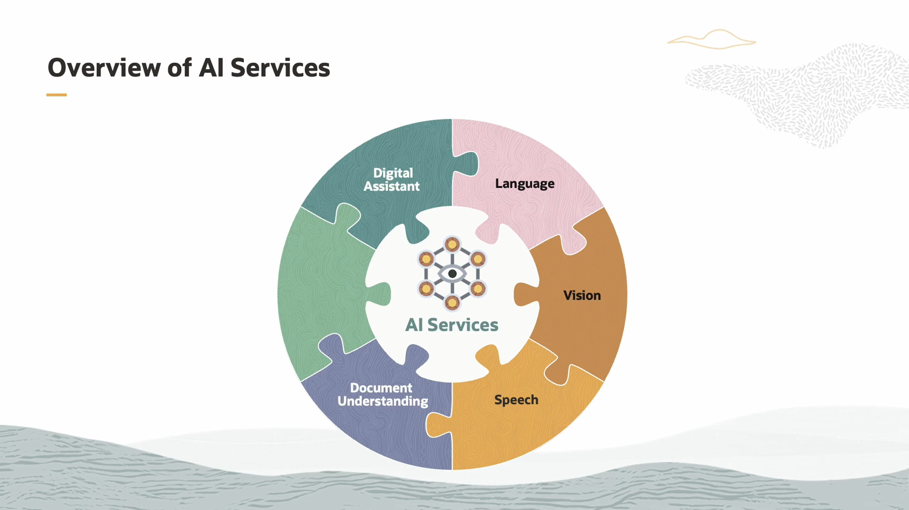

# Language Overview (Language Models)

Language models are AI systems designed to understand, generate, and work with human language. They analyze patterns in text to predict the next word, complete sentences, translate languages, or even generate creative content.

Key Points:

  * They are trained on vast amounts of text data.

  * Use statistical and deep learning techniques to grasp grammar, context, and meaning.

  *  Examples include GPT, BERT, and Transformer models.

  * Applications: chatbots, translation, sentiment analysis, summarization, and more.

  # Vision Overview(vision Models)

   Computer Vision is a field of artificial intelligence focused on enabling machines to interpret and understand visual information from the world, such as images and videos.

 Key Points:

   * It involves tasks like image recognition, object detection, image segmentation, and video analysis.

   * Uses techniques such as Convolutional Neural Networks (CNNs) to automatically extract features and patterns from visual data.

   * Applied in areas like self-driving cars, facial recognition, medical imaging, and surveillance.

## Speech Overview:

Speech processing is a branch of artificial intelligence focused on enabling machines to understand, interpret, and generate human speech.

 Key Points:

  * Includes tasks like speech recognition (converting spoken words to text), speech synthesis (text-to-speech), and speaker identification.

  * Uses models like RNNs, LSTMs, and more recently Transformers to process and analyze audio data.

  * Applied in virtual assistants (like Siri and Alexa), transcription services, language translation, and voice-controlled devices.

## Document Understanding:

Document Understanding is a field in AI that focuses on enabling machines to read, interpret, and extract meaningful information from documents such as PDFs, scanned images, forms, and text files.

Key Points:

  * Combines technologies like Natural Language Processing (NLP), Optical Character Recognition (OCR), and Computer Vision.

  * Tasks include text extraction, entity recognition, classification, and summarization of documents.

  * Used in automating workflows like invoice processing, contract analysis, and legal document review.

## Digital Assistant:

A Digital Assistant is an AI-powered software designed to help users perform tasks, answer questions, and provide information through natural language interactions, often via voice or text.

Key Points:

  * Uses technologies like Natural Language Processing (NLP), Speech Recognition, and Machine Learning.

  * Examples include Siri, Alexa, Google Assistant, and Cortana.

  * Can perform tasks like setting reminders, answering queries, controlling smart devices, and managing schedules.

