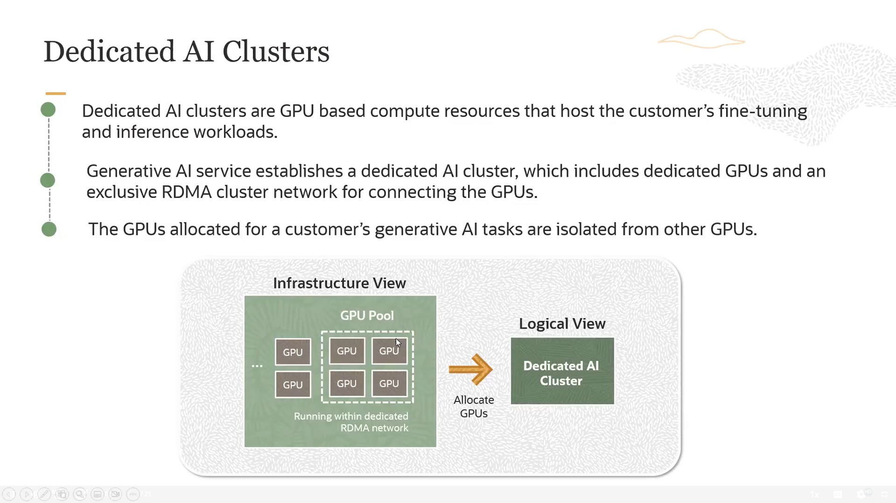

##  Command-R-Plus(chat)
  * It’s a type of AI language model, usually from the LLaMA family or similar large language models (LLMs).

  * It’s instruction-tuned, meaning it’s optimized to better follow user commands and instructions.

  * Generally, it’s an improved version aimed at understanding and responding to instructions more accurately.

## Command-R-16k(chat)

  * This is an enhanced version of Command-R-Plus with a key difference:

  * It supports a larger context window — up to 16,000 tokens (words or subwords) at once.

  * This allows it to process and understand much longer texts or conversations without losing context.

## LLaMA 3 70B Instruct(chat)

  * This is a very large model from the LLaMA 3 series with 70 billion parameters (which means it’s very powerful).

  * It is instruction-tuned specifically to follow user commands well.

  * Because of its size, it requires a lot of computing resources but can deliver very advanced understanding and generation capabilities.

## What Embedding  models?

Embedding models convert words or sentences into numerical *vectors* that represent their meaning mathematically, so computers can understand and compare them easily.

   Used for:

   Searching similar texts or images

   Text classification

   Translation and sentiment analysis

Example: The embeddings for "cat" and "dog" are close because they have related meanings.

## What AI detecting clusters?

it means that artificial intelligence uses algorithms and techniques to find groups or clusters within data, where items inside each group are similar to each other, and items in different groups are different.

 For example:
   if you have data about people, the AI model might discover clusters of customers with similar traits or behaviors (like customers who buy the same type of products).

# What is custom model?
 an AI model trained on specific data or for a specific domain to be more accurate in that area than general models.

 Example: : An AI model trained only on medical data to answer medical questions accurately.

 # Embedding 

